# シス管系女子 ハンズオン

subtitle
:   試して覚えよう！ SSHポートフォワーディング

author
:   Piro / 結城洋志

institution
:   株式会社クリアコード

allotted_time
:   60m

# SSHポートフォワードって何？

 * SSHの通信経路を使ったパケット転送
 * 別々のネットワーク同士を繋げられる
 * 「トンネリング」などとも呼ばれる

# こんな事、ありませんか？：社外から社内へ

（イラスト）

 * 社内ネットワーク内からしかアクセスできない社内サイトがある。
 * 自分は今、社外にいるが、社内サイトにアクセスしたい。
   * 大事な資料がそこにしかないが、ダウンロードしておくのを忘れていた。
   * 寝坊してしまったが、こっそり「出勤」ボタンをクリックしたい。

# こんな事、ありませんか？：社内から社外へ

（イラスト）

 * 自分は今、社外にいるが、手元のPCでトラブルが発生している。
 * 社内にいる頼れる先輩に連絡して、リモート操作でトラブルを解決してもらいたい。

# 使用するサーバーを準備しよう

踏み台になるサーバーと
社内専用Webサーバーを用意しよう

# 目指すゴール

{:relative_height='95'}

# ローカルネットワークの作成 (1/5)

{:relative_height='95'}

# ローカルネットワークの作成 (2/5)

{:relative_height='95'}

# ローカルネットワークの作成 (3/5)

{:relative_height='95'}

# ローカルネットワークの作成 (4/5)

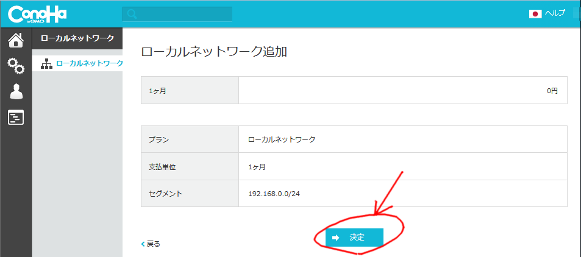{:relative_height='95'}

# ローカルネットワークの作成 (5/5)

{:relative_height='95'}

# 踏み台にするVPSの用意

「front」と呼ぶ事にする。

# frontの作成 (1/5)

{:relative_height='95'}

# frontの作成 (2/5)

{:relative_height='95'}

# frontの作成 (3/5)

{:relative_height='95'}

既定のテンプレートイメージで作成する。
[メモ用シート](printable-sheets/memo.html)にrootのパスワードを書き込んでおく。

# frontの作成 (4/5)

{:relative_height='95'}

# frontの作成 (5/5)

{:relative_height='95'}

# frontの名前の設定

{:relative_height='95'}

分かりやすいように「front」とラベルを付ける。

# frontのIPアドレスの確認

{:relative_height='95'}

[メモ用シート](printable-sheets/memo.html)にIPアドレスを書き込んでおく。

# frontのシャットダウン (1/3)

{:relative_height='95'}

# frontのシャットダウン (2/3)

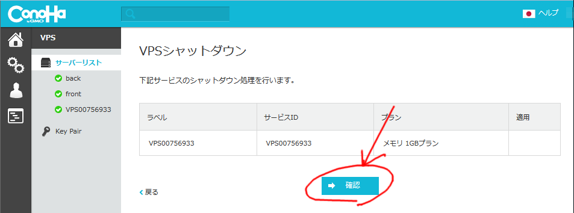{:relative_height='95'}

# frontのシャットダウン (3/3)

{:relative_height='95'}

# frontのネットワークインターフェース設定 (1/5)

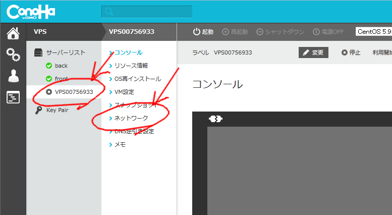{:relative_height='95'}

# frontのネットワークインターフェース設定 (2/5)

{:relative_height='95'}

# frontのネットワークインターフェース設定 (3/5)

{:relative_height='95'}

# frontのネットワークインターフェース設定 (4/5)

{:relative_height='95'}

# frontのネットワークインターフェース設定 (5/5)

{:relative_height='95'}

# frontの再起動 (1/4)

{:relative_height='95'}

# frontの再起動 (2/4)

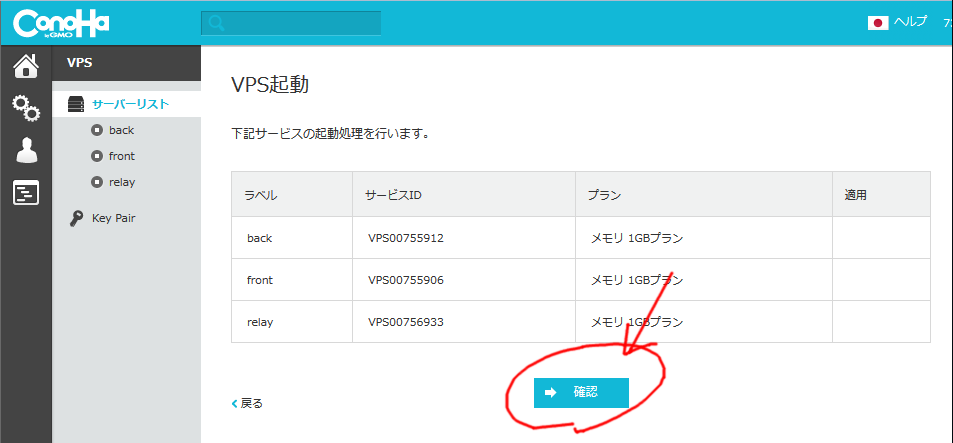{:relative_height='95'}

# frontの再起動 (3/4)

{:relative_height='95'}

# frontの再起動 (4/4)

{:relative_height='95'}

# frontの初期化 (1/6)

{:relative_height='95'}

# frontの初期化 (2/6)

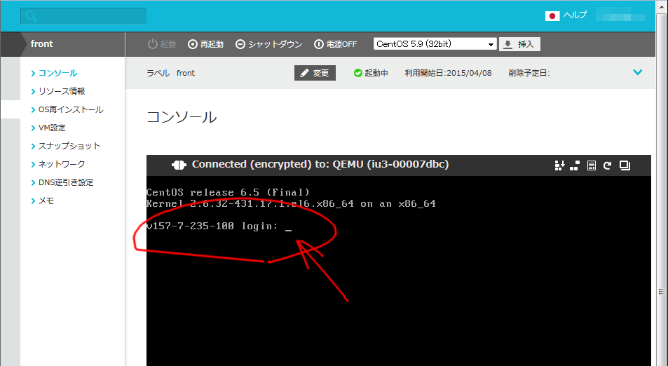{:relative_height='95'}

# frontの初期化 (3/6)

{:relative_height='95'}

~~~
root@front# curl https://raw.githubusercontent.com/piroor/system-admin-girl-handson/master/scripts/setup-front.sh | bash
~~~

# frontの初期化 (4/6)

{:relative_height='95'}

# frontの初期化 (5/6)

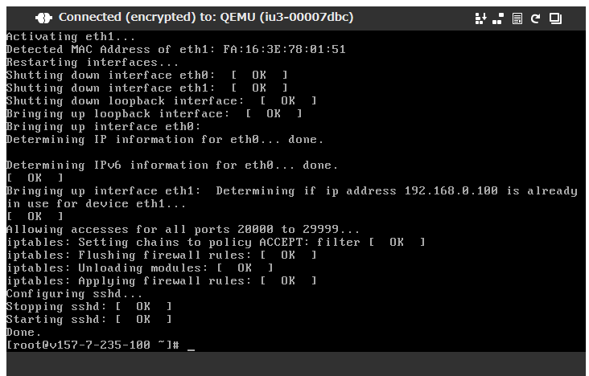{:relative_height='95'}

# frontの初期化 (6/6)

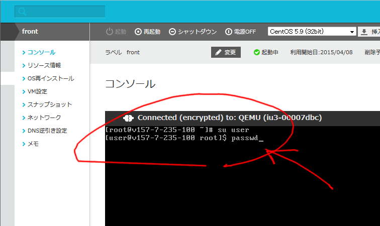{:relative_height='95'}

~~~
root@front# su user
user@front$ passwd
~~~

[メモ用シート](printable-sheets/memo.html)にuserのパスワードを書き込んでおく。

# 社内専用サーバーにするVPSの用意

「back」と呼ぶ事にする。

# backの作成 (1/2)

{:relative_height='95'}

# backの作成 (2/2)

{:relative_height='95'}

nginx, WordPress入りのテンプレートイメージを選択する。
[メモ用シート](printable-sheets/memo.html)にrootのパスワードを書き込んでおく。

# backの名前の設定

{:relative_height='95'}

分かりやすいように「back」とラベルを付ける。

# backのIPアドレスの確認

{:relative_height='95'}

[メモ用シート](printable-sheets/memo.html)にIPアドレスを書き込んでおく。

# backのネットワーク設定

frontと同じ手順で、プライベートネットワークに参加させる。

 1. シャットダウン
 2. ネットワークインターフェースを追加
 3. 起動

# backの初期化 (1/2)

frontと同じ手順で、スクリプトを使って初期化する。

スクリプトのダウンロードURLがfront用とは異なるので注意する。

~~~
root@back# curl https://raw.githubusercontent.com/piroor/system-admin-girl-handson/master/scripts/setup-back.sh | bash
~~~

# backの初期化 (2/2)

初期化が完了したら、userユーザのパスワードを変更しておく。

~~~
root@back# su user
user@back$ passwd
~~~

[メモ用シート](printable-sheets/memo.html)にuserのパスワードを書き込んでおく。

# WordPressの動作確認 (1/3)

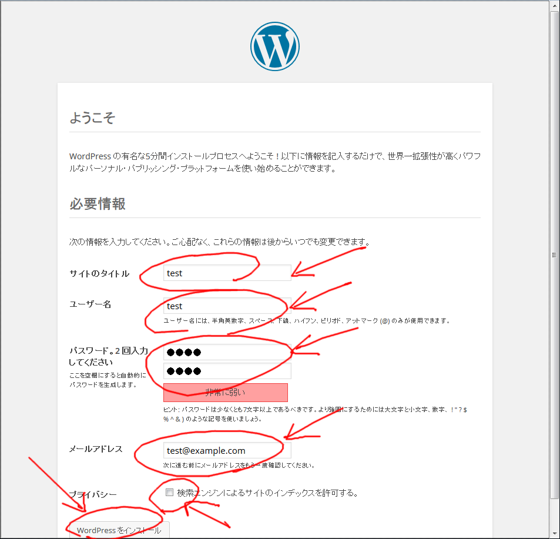{:relative_height='95'}

backのIPアドレスを指定してブラウザで開いてみる。
初期設定の画面が出るので、適当に設定する。

例： http://back/

# WordPressの動作確認 (2/3)

{:relative_height='95'}

# WordPressの動作確認 (3/3)

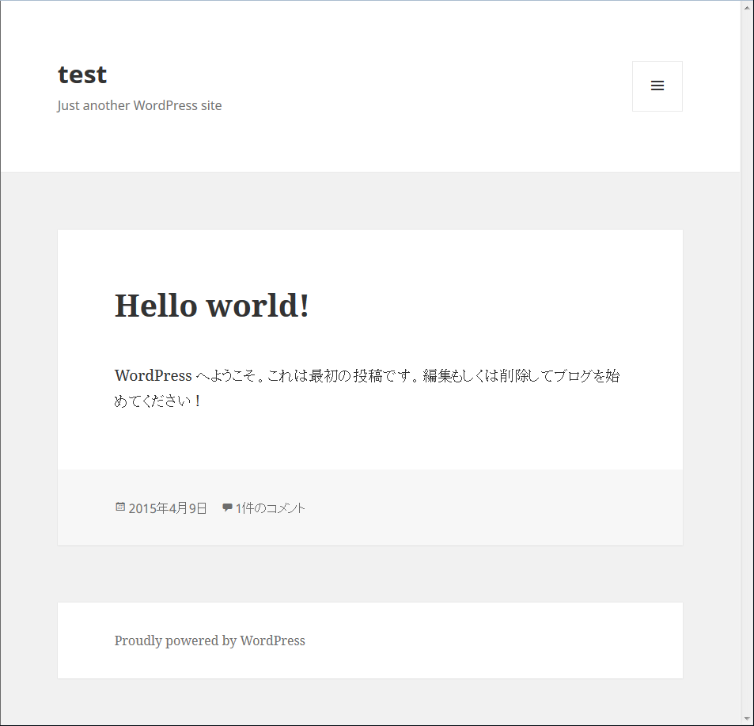{:relative_height='95'}

もう1度、backのIPアドレスを指定してブラウザで開いてみる。
セットアップが完了したWordPressの画面が出る。

例： http://back/

# backをインターネットから切り離す

backにログインし、root権限でrootのホームにある設定変更用スクリプトを実行する。

~~~
# ~/deactivate-eth0.sh
~~~

# 準備完了

{:relative_height='95'}

# SSHポートフォワーディングを試してみよう

# ポートフォワーディングとは？

{:relative_height='95'}

# Case0:

ポートフォワードが
必要ないケース

# Case0-1: 社外から社内サーバーにログインしたい

{:relative_height='95'}

# step1: 中継サーバーにログイン

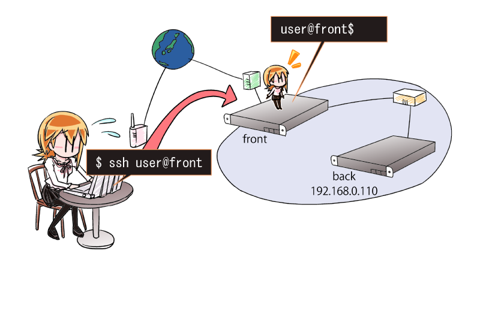{:relative_height='95'}

~~~
$ ssh user@front
~~~

# step2: 社内サーバーにログイン

{:relative_height='95'}

~~~
user@front$ ssh user@192.168.0.110
~~~

# Case0-2: 社外PCから社内サーバーにファイルをアップロードしたい

{:relative_height='95'}

# step1: ファイルを中継サーバーにコピー

{:relative_height='95'}

~~~
$ echo "Hello!" >  /tmp/localfile
$ scp /tmp/localfile user@front:/tmp/uploadedfile
~~~

# step2: 中継サーバーにログイン

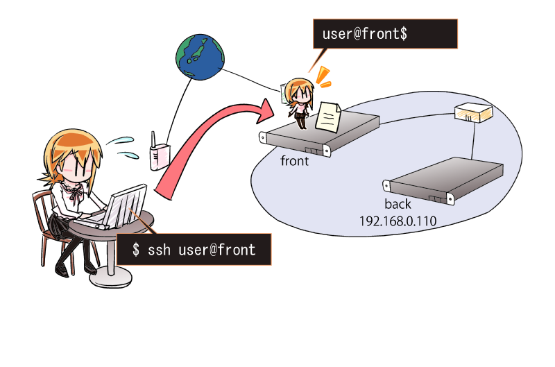{:relative_height='95'}

~~~
$ ssh user@front
~~~

# step3: 中継サーバーから社内サーバーにコピー

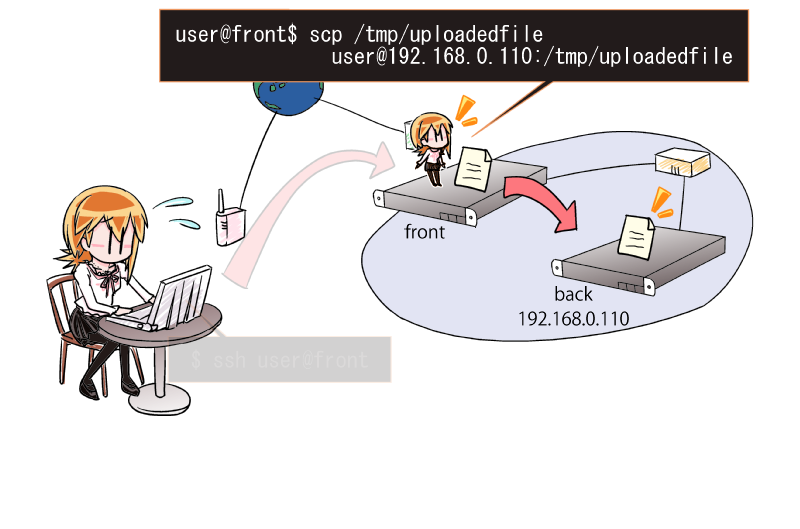{:relative_height='95'}

~~~
user@front$ scp /tmp/uploadedfile user@192.168.0.110:/tmp/uploadedfile
~~~

# Case1

ローカルフォワード
（順方向のポートフォワード）

# ローカル→リモートの転送

{:relative_height='95'}

# Case1-1: 社外から社内サーバーに直接ファイルをアップロードしたい

{:relative_height='95'}

# step1: ローカルフォワードを確立

{:relative_height='95'}

~~~
$ ssh user@front -L 10022:192.168.0.110:22
~~~

# step1: ローカルフォワードを確立

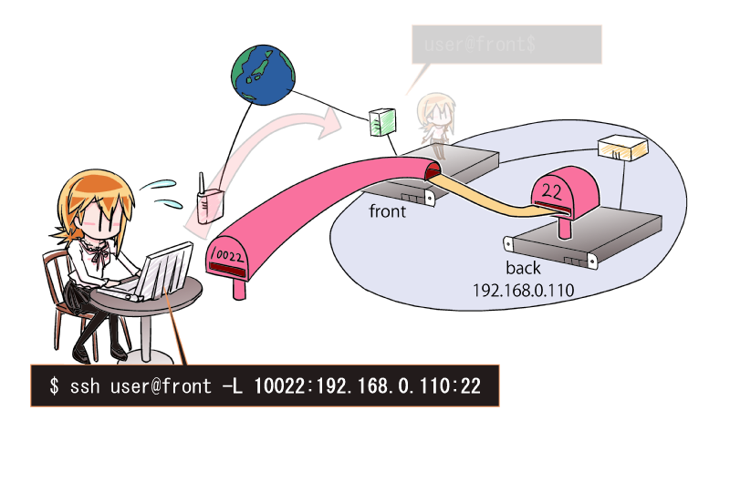{:relative_height='95'}

~~~
$ ssh user@front -L 10022:192.168.0.110:22
~~~

# step2: ファイルをコピー

{:relative_height='95'}

~~~
$ scp -P 10022 /tmp/localfile user@localhost:/tmp/uploadedfile2
$ scp -P 10022 user@localhost:/tmp/uploadedfile2 /tmp/downloadedfile
~~~

# Case1-2: 社外から社内Webサイトを見たい

{:relative_height='95'}

# step1: ローカルフォワードを確立

{:relative_height='95'}

~~~
$ ssh user@front -L 10080:192.168.0.110:80
~~~

# step2: HTTPリクエストを送る

{:relative_height='95'}

~~~
$ firefox http://localhost:10080/
~~~

# Case2:

リモートフォワード
（逆方向のポートフォワード）

# リモート→ローカルの転送

{:relative_height='95'}

# Case2-1: 社内から社外のPCにログインしたい

{:relative_height='95'}

手元のPCにはguestというユーザーを作成済みで、
パスワード認証できるものとする。

# step1: リモートフォワードを確立

{:relative_height='95'}

~~~
$ ssh user@front -R 20022:localhost:22
~~~

# step1: リモートフォワードを確立

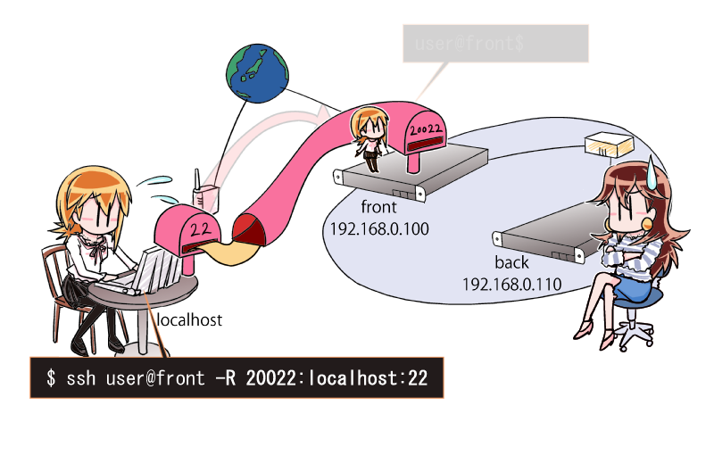{:relative_height='95'}

~~~
$ ssh user@front -R 20022:localhost:22
~~~

# step2: 中継サーバーにログイン

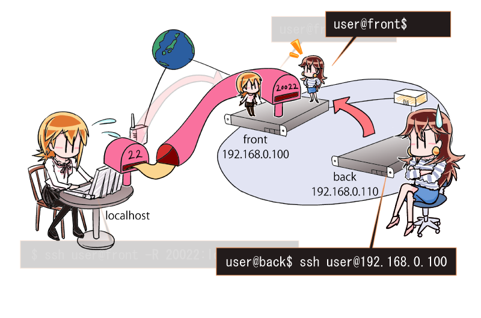{:relative_height='95'}

~~~
user@back$ ssh user@192.168.0.100
~~~

# step3: 社外PCにログイン

{:relative_height='95'}

~~~
user@front$ ssh -p 20022 guest@localhost
~~~

# Case2-2: 外部から侵入不可能なネットワーク内のサーバーに、社外からログインしたい

{:relative_height='95'}

# 準備1: frontに社外からログインできなくする

{:relative_height='95'}

~~~
root@front# ./disallow-ssh.sh
~~~

# 確かめてみよう

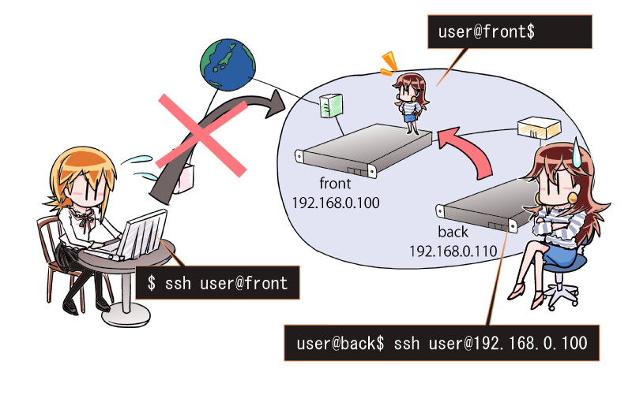{:relative_height='95'}

~~~
$ ssh user@back
~~~

~~~
user@back$ ssh user@192.168.0.100
~~~

# 準備2: 新たな中継サーバーを用意する

{:relative_height='95'}

# 準備2: 新たな中継サーバーを用意する

 * VPSを作成する
 * コンソールからログインして初期設定を行う

~~~
root@relay# curl https://raw.githubusercontent.com/piroor/system-admin-girl-handson/master/scripts/setup-relay.sh | bash
root@relay# su user
user@relay$ passwd
~~~

[メモ用シート](printable-sheets/memo.html)に各種情報を書き込んでおく。

# step1: リモートフォワードの確立

{:relative_height='95'}

~~~
user@front$ ssh user@relay -R 20022:192.168.0.110:22
~~~

# step1: リモートフォワードの確立

{:relative_height='95'}

~~~
user@front$ ssh user@relay -R 20022:192.168.0.110:22
~~~

# step2: relayへログイン

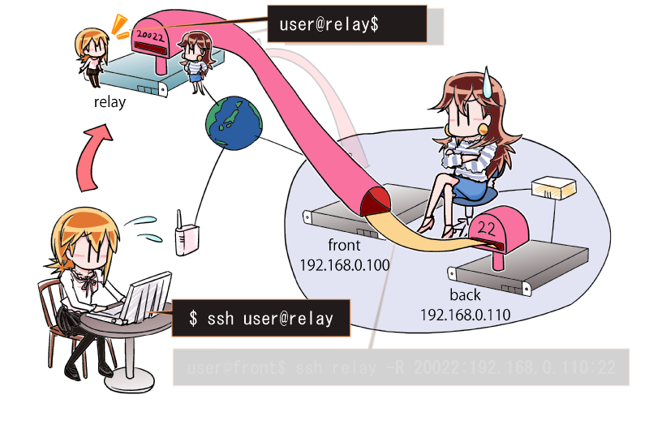{:relative_height='95'}

~~~
$ ssh user@relay
~~~

# step3: 社内サーバーへログイン

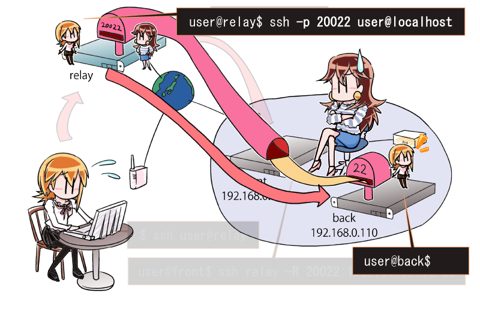{:relative_height='95'}

~~~
user@relay$ ssh -p 20022 user@localhost
~~~

# Case3: 

ローカルフォワードと
リモートフォワードの
合わせ技

# 外部から侵入不可能なネットワーク内の社内サーバーに、社外からHTTP接続したい

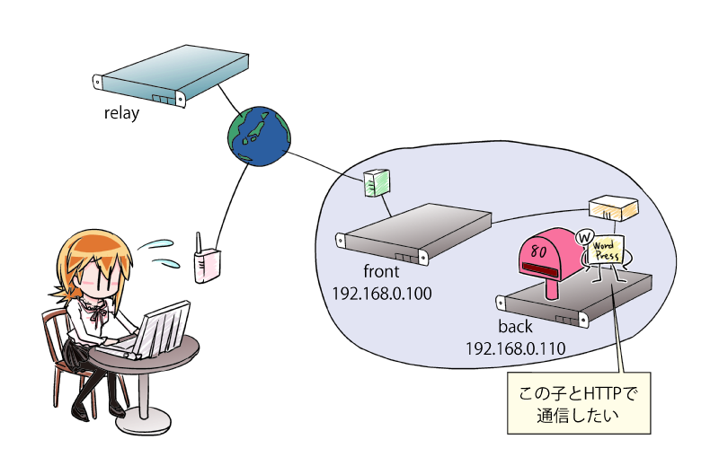{:relative_height='95'}

# step1: リモートフォワードの確立

{:relative_height='95'}

~~~
user@front$ ssh user@relay -R 20080:192.168.0.110:80
~~~

# step2: ローカルフォワードの確立

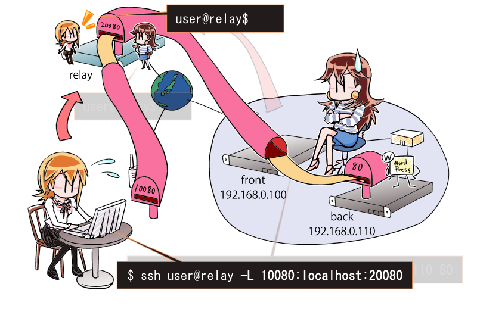{:relative_height='95'}

~~~
$ ssh user@relay -L 10080:localhost:20080
~~~

# step3: HTTPリクエストを送る

{:relative_height='95'}

~~~
$ firefox http://localhost:10080/
~~~

